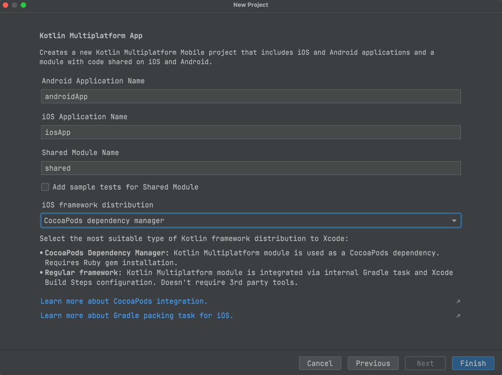
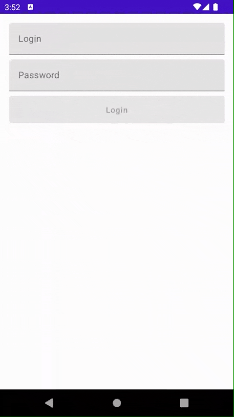
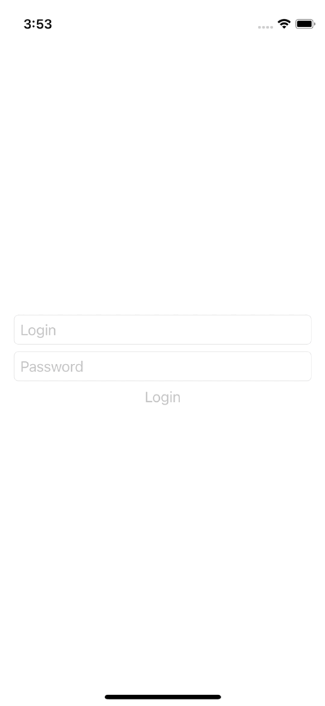

# Как использовать Kotlin Multiplatform ViewModel в SwiftUI и Jetpack Compose

Мы в [IceRock Development](https://icerock.dev) уже много лет пользуемся подходом MVVM, а последние
4 года наши `ViewModel` расположены в общем коде, за счет использования нашей библиотеки
[moko-mvvm](https://github.com/icerockdev/moko-mvvm). В последний год мы активно переходим на 
использование Jetpack Compose и SwiftUI для построения UI в наших проектах. И это потребовало 
улучшения MOKO MVVM, чтобы разработчикам на обеих платформах было удобно работать с таким подходом. 

30 апреля 2022 вышла [новая версия MOKO MVVM - 0.13.0](https://github.com/icerockdev/moko-mvvm/releases/tag/release%2F0.13.0). 
В этой версии появилась полноценная поддержка Jetpack Compose и SwiftUI. Разберем на примере как 
можно использовать ViewModel из общего кода с данными фреймворками.

Пример будет простой - приложение с экраном авторизации. Два поля ввода - логин и пароль, кнопка 
Войти и сообщение о успешном входе после секунды ожидания (во время ожидания крутим прогресс бар).

## Создаем проект

Первый шаг простой - берем Android Studio, устанавливаем 
[Kotlin Multiplatform Mobile IDE плагин](https://plugins.jetbrains.com/plugin/14936-kotlin-multiplatform-mobile),
если еще не установлен. Создаем проект по шаблону "Kotlin Multiplatform App" с использованием 
`CocoaPods integration` (с ними удобнее, плюс нам все равно потребуется подключать дополнительный 
CocoaPod).



[git commit](https://github.com/Alex009/moko-mvvm-compose-swiftui/commit/ee223a80e17616e622d135c0651ab454eabfad7a)

## Экран авторизации на Android с Jetpack Compose

В шаблоне приложения используется стандартный подход с Android View, поэтому нам нужно подключить 
Jetpack Compose перед началом верстки. 

Включаем в `androidApp/build.gradle.kts` поддержку Compose:
```kotlin
val composeVersion = "1.1.1"

android {
    // ...

    buildFeatures {
        compose = true
    }
    composeOptions {
        kotlinCompilerExtensionVersion = composeVersion
    }
}
```

И подключаем необходимые нам зависимости, удаляя старые ненужные (относящиеся к обычному подходу с 
View):
```kotlin
dependencies {
    implementation(project(":shared"))

    implementation("androidx.compose.foundation:foundation:$composeVersion")
    implementation("androidx.compose.runtime:runtime:$composeVersion")
    // UI
    implementation("androidx.compose.ui:ui:$composeVersion")
    implementation("androidx.compose.ui:ui-tooling:$composeVersion")
    // Material Design
    implementation("androidx.compose.material:material:$composeVersion")
    implementation("androidx.compose.material:material-icons-core:$composeVersion")
    // Activity
    implementation("androidx.activity:activity-compose:1.4.0")
    implementation("androidx.appcompat:appcompat:1.4.1")
}
```

При выполнении Gradle Sync получаем сообщение о несовместимости версии Jetpack Compose и Kotlin. 
Это связано с тем что Compose использует компиляторный плагин для Kotlin, а API компиляторных 
плагинов пока не стабилизировано. Поэтому нам нужно поставить ту версию Kotlin, которую поддерживает
используемая нами версия Compose - `1.6.10`.

Далее остается сверстать экран авторизации, привожу сразу готовый код:
```kotlin
@Composable
fun LoginScreen() {
    val context: Context = LocalContext.current
    val coroutineScope: CoroutineScope = rememberCoroutineScope()

    var login: String by remember { mutableStateOf("") }
    var password: String by remember { mutableStateOf("") }
    var isLoading: Boolean by remember { mutableStateOf(false) }

    val isLoginButtonEnabled: Boolean = login.isNotBlank() && password.isNotBlank() && !isLoading

    Column(
        modifier = Modifier.padding(16.dp),
        horizontalAlignment = Alignment.CenterHorizontally
    ) {
        TextField(
            modifier = Modifier.fillMaxWidth(),
            value = login,
            enabled = !isLoading,
            label = { Text(text = "Login") },
            onValueChange = { login = it }
        )
        Spacer(modifier = Modifier.height(8.dp))
        TextField(
            modifier = Modifier.fillMaxWidth(),
            value = password,
            enabled = !isLoading,
            label = { Text(text = "Password") },
            visualTransformation = PasswordVisualTransformation(),
            onValueChange = { password = it }
        )
        Spacer(modifier = Modifier.height(8.dp))
        Button(
            modifier = Modifier
                .fillMaxWidth()
                .height(48.dp),
            enabled = isLoginButtonEnabled,
            onClick = {
                coroutineScope.launch {
                    isLoading = true
                    delay(1000)
                    isLoading = false
                    Toast.makeText(context, "login success!", Toast.LENGTH_SHORT).show()
                }
            }
        ) {
            if (isLoading) CircularProgressIndicator(modifier = Modifier.size(24.dp))
            else Text(text = "Login")
        }
    }
}
```

И вот наше приложение для Android с экраном авторизации готово и функционирует как требуется, но без 
общего кода.



[git commit](https://github.com/Alex009/moko-mvvm-compose-swiftui/commit/69cf1904cd16f34b5bc646cdcacda3b72c8b58cf)

## Экран авторизации в iOS с SwiftUI

Сделаем тот же экран в SwiftUI. Шаблон уже создал SwiftUI приложение, поэтому нам достаточно просто
написать код экрана. Получаем следующий код:

```swift
struct LoginScreen: View {
    @State private var login: String = ""
    @State private var password: String = ""
    @State private var isLoading: Bool = false
    @State private var isSuccessfulAlertShowed: Bool = false
    
    private var isButtonEnabled: Bool {
        get {
            !isLoading && !login.isEmpty && !password.isEmpty
        }
    }
    
    var body: some View {
        Group {
            VStack(spacing: 8.0) {
                TextField("Login", text: $login)
                    .textFieldStyle(.roundedBorder)
                    .disabled(isLoading)
                
                SecureField("Password", text: $password)
                    .textFieldStyle(.roundedBorder)
                    .disabled(isLoading)
                
                Button(
                    action: {
                        isLoading = true
                        DispatchQueue.main.asyncAfter(deadline: .now() + 1) {
                            isLoading = false
                            isSuccessfulAlertShowed = true
                        }
                    }, label: {
                        if isLoading {
                            ProgressView()
                        } else {
                            Text("Login")
                        }
                    }
                ).disabled(!isButtonEnabled)
            }.padding()
        }.alert(
            "Login successful",
            isPresented: $isSuccessfulAlertShowed
        ) {
            Button("Close", action: { isSuccessfulAlertShowed = false })
        }
    }
}
```

Логика работы полностью идентична Android версии и также не использует никакой общей логики.



[git commit](https://github.com/Alex009/moko-mvvm-compose-swiftui/commit/760622ab392b1e723e4bb508d8f5c8b97b9ca5a7)

## Реализуем общую ViewModel

Все подготовительные шаги завершены. Пора вынести из платформ логику работы экрана авторизации в 
общий код.

Первое, что для этого мы сделаем - подключим в общий модуль зависимость moko-mvvm и добавим ее в 
список export'а для iOS framework (чтобы в Swift мы видели все публичные классы и методы этой 
библиотеки).

```kotlin
val mokoMvvmVersion = "0.13.0"

kotlin {
    // ...

    cocoapods {
        // ...
        
        framework {
            baseName = "MultiPlatformLibrary"

            export("dev.icerock.moko:mvvm-core:$mokoMvvmVersion")
            export("dev.icerock.moko:mvvm-flow:$mokoMvvmVersion")
        }
    }

    sourceSets {
        val commonMain by getting {
            dependencies {
                api("org.jetbrains.kotlinx:kotlinx-coroutines-core:1.6.1-native-mt")

                api("dev.icerock.moko:mvvm-core:$mokoMvvmVersion")
                api("dev.icerock.moko:mvvm-flow:$mokoMvvmVersion")
            }
        }
        // ...
        val androidMain by getting {
            dependencies {
                api("dev.icerock.moko:mvvm-flow-compose:$mokoMvvmVersion")
            }
        }
        // ...
    }
}
```

Также мы изменили `baseName` у iOS Framework на `MultiPlatformLibrary`. Это важное изменение, без
которого мы в дальнейшем не сможем подключить CocoaPod с функциями интеграции Kotlin и SwiftUI.

Осталось написать саму `LoginViewModel`. Вот код:
```kotlin
class LoginViewModel : ViewModel() {
    val login: MutableStateFlow<String> = MutableStateFlow("")
    val password: MutableStateFlow<String> = MutableStateFlow("")

    private val _isLoading: MutableStateFlow<Boolean> = MutableStateFlow(false)
    val isLoading: StateFlow<Boolean> = _isLoading

    val isButtonEnabled: StateFlow<Boolean> =
        combine(isLoading, login, password) { isLoading, login, password ->
            isLoading.not() && login.isNotBlank() && password.isNotBlank()
        }.stateIn(viewModelScope, SharingStarted.Eagerly, false)

    private val _actions = Channel<Action>()
    val actions: Flow<Action> get() = _actions.receiveAsFlow()

    fun onLoginPressed() {
        _isLoading.value = true
        viewModelScope.launch {
            delay(1000)
            _isLoading.value = false
            _actions.send(Action.LoginSuccess)
        }
    }

    sealed interface Action {
        object LoginSuccess : Action
    }
}
```

Для полей ввода, которые может менять пользователь, мы использовали `MutableStateFlow` из 
kotlinx-coroutines (но можно использовать и `MutableLiveData` из `moko-mvvm-livedata`).
Для свойств, которые UI должен отслеживать, но не должен менять - используем `StateFlow`.
А для оповещения о необходимости что-то сделать (показать сообщение о успехе или чтобы перейти 
на другой экран) мы создали `Channel`, который выдается на UI в виде `Flow`. Все доступные действия
мы объединяем под единый `sealed interface Action`, чтобы точно было известно какие действия может 
сообщить данная `ViewModel`. 

[git commit](https://github.com/Alex009/moko-mvvm-compose-swiftui/commit/d628fb60fedeeb0d259508aa09d3a98ebbc9651c)

## Подключаем общую ViewModel к Android

На Android чтобы получить из `ViewModelStorage` нашу `ViewModel` (чтобы при поворотах экрана мы 
получали туже-самую ViewModel) нам нужно подключить специальную зависимость в 
`androidApp/build.gradle.kts`:

```kotlin
dependencies {
    // ...
    implementation("androidx.lifecycle:lifecycle-viewmodel-compose:2.4.1")
}
```

Далее добавим в аргументы нашего экрана `LoginViewModel`:
```kotlin
@Composable
fun LoginScreen(
    viewModel: LoginViewModel = viewModel()
)
```

Заменим локальное состояние экрана, на получение состояния из `LoginViewModel`:
```kotlin
val login: String by viewModel.login.collectAsState()
val password: String by viewModel.password.collectAsState()
val isLoading: Boolean by viewModel.isLoading.collectAsState()
val isLoginButtonEnabled: Boolean by viewModel.isButtonEnabled.collectAsState()
```

Подпишемся на получение действий от ViewModel'и используя `observeAsAction` из moko-mvvm:
```kotlin
viewModel.actions.observeAsActions { action ->
    when (action) {
        LoginViewModel.Action.LoginSuccess ->
            Toast.makeText(context, "login success!", Toast.LENGTH_SHORT).show()
    }
}
```

Заменим обработчик ввода у `TextField`'ов с локального состояния на запись в `ViewModel`:
```kotlin
TextField(
    // ...
    onValueChange = { viewModel.login.value = it }
)
```

И вызовем обработчик нажатия на кнопку авторизации:
```kotlin
Button(
    // ...
    onClick = viewModel::onLoginPressed
) {
    // ...
}
```

Запускаем приложение и видим что все работает точно также, как работало до общего кода, но теперь 
вся логика работы экрана управляется общей ViewModel.

[git commit](https://github.com/Alex009/moko-mvvm-compose-swiftui/commit/a93b9a3b6f1e413bebbba3a30bc5a198ebbf4e84)

## Подключаем общую ViewModel к iOS

Для подключения `LoginViewModel` к SwiftUI нам потребуются Swift дополнения от MOKO MVVM. 
Подключаются они через CocoaPods:

```ruby
pod 'mokoMvvmFlowSwiftUI', :podspec => 'https://raw.githubusercontent.com/icerockdev/moko-mvvm/release/0.13.0/mokoMvvmFlowSwiftUI.podspec'
```

А также, в самой `LoginViewModel` нужно внести изменения - со стороны Swift `MutableStateFlow`, 
`StateFlow`, `Flow` потеряют generic type, так как это интерфейсы. Чтобы generic не был потерян 
нужно использовать классы. MOKO MVVM предоставляет специальные классы `CMutableStateFlow`, 
`CStateFlow` и `CFlow` для сохранения generic type в iOS. Приведем типы следующим изменением:

```kotlin
class LoginViewModel : ViewModel() {
    val login: CMutableStateFlow<String> = MutableStateFlow("").cMutableStateFlow()
    val password: CMutableStateFlow<String> = MutableStateFlow("").cMutableStateFlow()

    // ...
    val isLoading: CStateFlow<Boolean> = _isLoading.cStateFlow()

    val isButtonEnabled: CStateFlow<Boolean> =
        // ...
        .cStateFlow()
    
    // ...
    val actions: CFlow<Action> get() = _actions.receiveAsFlow().cFlow()

    // ...
}
```

Теперь можем переходить в Swift код. Для интеграции делаем следующее изменение:

```swift
import MultiPlatformLibrary
import mokoMvvmFlowSwiftUI
import Combine

struct LoginScreen: View {
    @ObservedObject var viewModel: LoginViewModel = LoginViewModel()
    @State private var isSuccessfulAlertShowed: Bool = false
    
    // ...
}
```

Мы добавляем `viewModel` в `View` как `@ObservedObject`, также как мы делаем с Swift версиями 
ViewModel, но в данном случе, за счет использования `mokoMvvmFlowSwiftUI` мы можем передать сразу 
Kotlin класс `LoginViewModel`.

Далее меняем привязку полей:
```swift
TextField("Login", text: viewModel.binding(\.login))
    .textFieldStyle(.roundedBorder)
    .disabled(viewModel.state(\.isLoading))
```

`mokoMvvmFlowSwiftUI` предоставляет специальные функции расширения к `ViewModel`:
- `binding` возвращает `Binding` структуру, для возможности изменения данных со стороны UI
- `state` возвращает значение, которое будет автоматически обновляться, когда `StateFlow` выдаст 
новые данные

Аналогичным образом заменяем другие места использования локального стейта и подписываемся на 
действия:
```swift
.onReceive(createPublisher(viewModel.actions)) { action in
    let actionKs = LoginViewModelActionKs(action)
    switch(actionKs) {
    case .loginSuccess:
        isSuccessfulAlertShowed = true
        break
    }
}
```

Функция `createPublisher` также предоставляется из `mokoMvvmFlowSwiftUI` и позволяет преобразовать
`CFlow` в `AnyPublisher` от Combine. Для надежности обработки действий мы используем 
[moko-kswift](https://github.com/icerockdev/moko-kswift). Это gradle плагин, который автоматически
генерирует swift код, на основе Kotlin. В данном случае был сгенерирован Swift 
`enum LoginViewModelActionKs` из `sealed interface LoginViewModel.Action`. Испольузя автоматически
генерируемый `enum` мы получаем гарантию соответствия кейсов в `enum` и в `sealed interface`, поэтому
теперь мы можем полагаться на exhaustive логику switch.
Подробнее про MOKO KSwift можно прочитать [в статье](https://habr.com/ru/post/571714/).

В итоге мы получили SwiftUI экран, который управляется из общего кода используя подход MVVM.

[git commit](https://github.com/Alex009/moko-mvvm-compose-swiftui/commit/5e260fbf9e4957c6fa5d1679a4282691d37da96a)

## Выводы

В разработке с Kotlin Multiplatform Mobile мы считаем важным стремиться предоставить удобный 
инструментарий для обеих платформ - и Android и iOS разработчики должны с комфортом вести разработку
и использование какого-либо подхода в общем коде не должно заставлять разработчиков одной из платформ
делать лишнюю работу. Разрабатывая наши [MOKO](https://moko.icerock.dev) библиотеки и инструменты мы
стремимся упростить работу разработчиков и под Android и iOS. Интеграция SwiftUI и MOKO MVVM 
потребовала множество экспериментов, но итоговый результат выглядит удобным в использовании.

Вы можете самостоятельно попробовать проект, созданный в этой статье, 
[на GitHub](https://github.com/Alex009/moko-mvvm-compose-swiftui).

Также, если вас интересует тема Kotlin Multiplatform Mobile, рекомендуем наши материалы на
[kmm.icerock.dev](https://kmm.icerock.dev).

Для начинающих разработчиков, желающих погрузиться в разработку под Android и iOS с Kotlin 
Multiplatform у нас работает корпоративный университет, материалы которого доступны всем на 
[kmm.icerock.dev - University](https://kmm.icerock.dev/university/intro). Желающие узнать больше 
о наших подходах к разработке могут также ознакомиться с материалами университета.

Мы также [можем помочь](https://icerockdev.com/directions/pages/kmm/) и командам разработки, 
которым нужна помощь в разработке или консультации по теме Kotlin Multiplatform Mobile.
